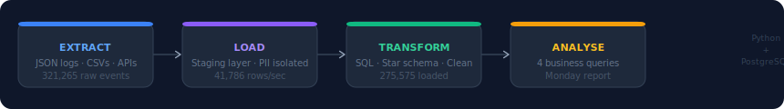
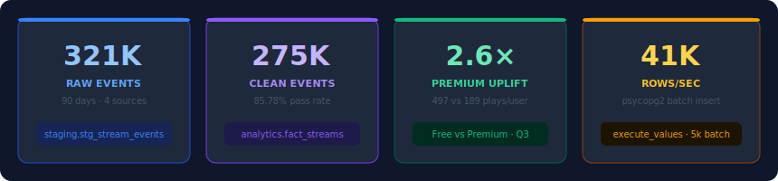
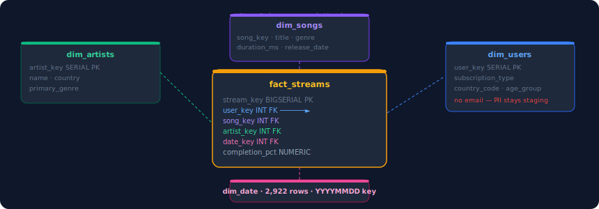
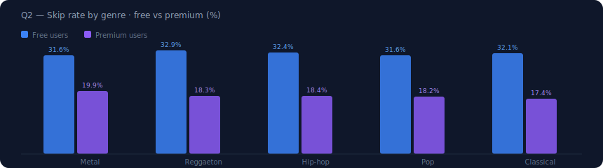
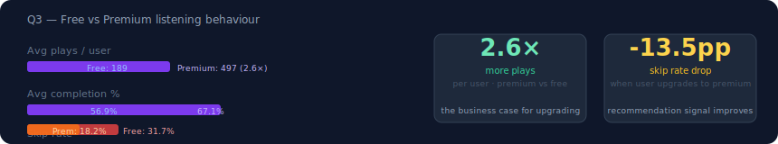

# Spotify Streaming Analytics — ELT Pipeline


An end-to-end ELT pipeline that takes raw Spotify streaming event logs, models them into a PostgreSQL star schema, and answers four business questions the analytics team needs every Monday morning — trending songs, genre skip rates, Free vs Premium behaviour, and regional breakout artists.

---



---

## The business problem

> Spotify has millions of listening events arriving every hour. The data team gets asked the same four questions every Monday. This pipeline answers all four in a single `psql` command.

| # | Question | Answer from this pipeline |
|---|---|---|
| Q1 | Top 10 trending songs last week | BTS "The Last" — 250 unique listeners |
| Q2 | Which genres have the worst skip rates? | Metal 23.9% · free users skip at 31.6% vs premium at 19.9% |
| Q3 | How different are Free vs Premium users? | Premium listens 2.6× more · skips 13.5pp less |
| Q4 | Which artists are breaking out regionally? | Makayla Christian (afrobeats) — 2.18× growth in France in 30 days |

---

## Key metrics



---

## What this project demonstrates

```
ELT architecture        End-to-end extract → load → transform flow
Dimensional modelling   Star schema: 1 fact table + 4 dimension tables
PostgreSQL DDL          Surrogate keys, FK constraints, index strategy
Batch loading           psycopg2 execute_values · 41,786 rows/sec
SQL transforms          CTEs, window functions, conditional aggregation
Data quality            Null handling, orphan detection, impossible-value filters
Data governance         PII isolation — email never leaves the staging layer
Synthetic data          Realistic patterns via Faker + weighted distributions
```

---

## Architecture

```
Source files (JSON)
        │
        ▼
┌────────────────────┐
│   staging schema   │  Raw data · append-only · PII lives here
│                    │
│  stg_stream_events │  321,265 rows
│  stg_users         │  1,000 rows  (contains email — stays here)
│  stg_songs         │  500 rows
│  stg_artists       │  150 rows
└──────────┬─────────┘
           │  SQL transforms  →  phase3_transform.sql
           ▼
┌────────────────────┐
│  analytics schema  │  Clean star schema · query-ready
│                    │
│  fact_streams ◄────┼── one row per valid play event
│  dim_users         │
│  dim_songs         │
│  dim_artists       │
│  dim_date          │  date spine 2020–2027 · pre-computed columns
└──────────┬─────────┘
           │  Business queries  →  phase4_queries.sql
           ▼
     Monday report
```

**Why ELT, not ETL?**
With PostgreSQL as the destination, transforms run as SQL inside the database — faster and simpler than transforming in Python first. Raw data stays in staging, so transforms are fully replayable without touching the source files again.

---

## Data model



### Staging layer — `staging.*`

| Table | Rows | Description |
|---|---|---|
| `stg_stream_events` | 321,265 | Raw play events · one row per listen |
| `stg_users` | 1,000 | User records including `email` (PII) |
| `stg_songs` | 500 | Song metadata from catalog |
| `stg_artists` | 150 | Artist records |

### Analytics layer — `analytics.*`

| Table | Rows | Type | Description |
|---|---|---|---|
| `fact_streams` | 275,575 | Fact | One row per valid play event |
| `dim_users` | 856 | Dimension | Active users · no PII |
| `dim_songs` | 500 | Dimension | Song attributes + genre |
| `dim_artists` | 150 | Dimension | Artist attributes |
| `dim_date` | 2,922 | Dimension | Date spine · pre-calculated week/day columns |

**45,690 rows were filtered during the transform** — impossible durations, orphan user/song references, and inactive user records. Every filter is documented in `phase3_transform.sql`.

### `fact_streams` — key columns

| Column | Type | Description |
|---|---|---|
| `stream_key` | `BIGSERIAL` | Surrogate PK |
| `event_id` | `VARCHAR UNIQUE` | Natural key from source · dedup guard |
| `user_key` | `INT FK` | → `dim_users` |
| `song_key` | `INT FK` | → `dim_songs` |
| `artist_key` | `INT FK` | → `dim_artists` · denormalised for speed |
| `date_key` | `INT FK` | → `dim_date` · stored as `YYYYMMDD` integer |
| `completion_pct` | `NUMERIC(5,2)` | % of song heard · capped at 100 |
| `was_skipped` | `BOOLEAN` | Core signal for recommendation quality |

---

## Results

### Q2 — Genre skip rates



Metal has the largest free/premium gap (31.6% vs 19.9% — a 12-point spread). This tells the recommendation team exactly where the algorithm is placing songs in front of users who aren't ready for them.

### Q3 — Free vs Premium



---

## Project structure

```
Spotify-Monday-Morning-Analytics/
│
├── images/                     # SVG charts embedded in this README
│   ├── pipeline_flow.svg
│   ├── key_metrics.svg
│   ├── star_schema.svg
│   ├── skip_rates.svg
│   └── free_vs_premium.svg
│
├── spotify_dataset/
│   ├── generate_data.py        # Synthetic data generator (Faker)
│   ├── stream_events.json      # Generated locally — not in git (~125 MB)
│   ├── users.json
│   ├── songs.json
│   └── artists.json
│
├── phase1_schema.sql           # Schemas · tables · indexes · FK constraints
├── phase2_load.py              # Python loader: JSON → staging + logging
├── phase3_transform.sql        # SQL transforms: staging → star schema
├── phase4_queries.sql          # 4 business queries (Monday report)
├── requirements.txt
├── pipeline.log                # Created by phase2_load.py (gitignored)
└── README.md
```

---

## Setup and run

Reproduce the full pipeline locally in about **10–15 minutes** (first time, including data generation).

### Prerequisites

| Tool | Version | Notes |
|---|---|---|
| Python | 3.9+ | `python3` and `pip` |
| PostgreSQL | 14+ | `psql`, `createdb`, and `pg_isready` on your `PATH` |

> **Run every command below from the repo root** — the folder that contains `phase1_schema.sql` and `phase2_load.py` (after clone, that is `Spotify-Monday-Morning-Analytics/`).

---

### Quick reference (after setup)

Once Postgres is installed and the database exists:

```bash
python3 spotify_dataset/generate_data.py          # once — creates JSON in spotify_dataset/
psql -d spotify_pipeline -f phase1_schema.sql
python3 phase2_load.py
psql -d spotify_pipeline -f phase3_transform.sql
psql -d spotify_pipeline -f phase4_queries.sql    # ← Monday report prints here
```

---

### Step 1 — Clone the repository

```bash
git clone https://github.com/kriti613/Spotify-Monday-Morning-Analytics.git
cd Spotify-Monday-Morning-Analytics
```

---

### Step 2 — Install and start PostgreSQL

<details>
<summary><strong>macOS (Homebrew)</strong></summary>

```bash
brew install postgresql@16
brew services start postgresql@16
```

Add PostgreSQL to your `PATH` (Apple Silicon — add to `~/.zshrc` to keep it permanent):

```bash
export PATH="/opt/homebrew/opt/postgresql@16/bin:$PATH"
```

Intel Macs use `/usr/local/opt/postgresql@16/bin` instead of `/opt/homebrew/...`.

</details>

<details>
<summary><strong>Ubuntu / Debian</strong></summary>

```bash
sudo apt update && sudo apt install -y postgresql postgresql-contrib
sudo service postgresql start
```

</details>

<details>
<summary><strong>Windows</strong></summary>

Install from [postgresql.org/download/windows](https://www.postgresql.org/download/windows/) and add the `bin` folder to your system `PATH` so `psql` works in PowerShell or Git Bash.

</details>

Confirm the server is up:

```bash
pg_isready
# expected: /tmp:5432 - accepting connections
```

---

### Step 3 — Install Python dependencies

```bash
pip install -r requirements.txt
# or: pip3 install -r requirements.txt
```

---

### Step 4 — Create the database

```bash
createdb spotify_pipeline
```

If you see **“role does not exist”** on macOS, Homebrew Postgres uses your Mac username — not `postgres`. `phase2_load.py` defaults to that automatically; you only need `export DB_USER=$(whoami)` if you overrode it earlier.

---

### Step 5 — Generate source data

JSON files live in `spotify_dataset/` and are **not in git** (`stream_events.json` is ~125 MB).

```bash
python3 spotify_dataset/generate_data.py
```

| File | Approx. size |
|---|---|
| `stream_events.json` | ~125 MB · 321,265 events |
| `users.json` | 1,000 users |
| `songs.json` | 500 songs |
| `artists.json` | 150 artists |

Takes **1–3 minutes**. Uses a fixed random seed (`42`) so results match the README unless you change the generator.

---

### Step 6 — Run the pipeline (in order)

| Phase | Command | What it does |
|---|---|---|
| **1** | `psql -d spotify_pipeline -f phase1_schema.sql` | Creates `staging` + `analytics` schemas, tables, indexes |
| **2** | `python3 phase2_load.py` | Loads JSON → staging; builds `dim_date`; writes `pipeline.log` |
| **3** | `psql -d spotify_pipeline -f phase3_transform.sql` | Cleans data → star schema (`fact_streams`, dimensions) |
| **4** | `psql -d spotify_pipeline -f phase4_queries.sql` | **Monday report** — four result tables in the terminal |

Copy-paste block:

```bash
psql -d spotify_pipeline -f phase1_schema.sql
python3 phase2_load.py
psql -d spotify_pipeline -f phase3_transform.sql
psql -d spotify_pipeline -f phase4_queries.sql
```

---

### What success looks like

**Phase 2** (console or `pipeline.log`):

```
✓ All 321,265 stream events loaded
Pipeline complete in ~5–15s
```

**Phase 3** (end of SQL output):

```
fact_streams | 275575
```

~45,690 staging rows are filtered (bad durations, orphans, inactive users).

**Phase 4** — four printed tables:

1. Top 10 trending songs (last 7 days) — e.g. BTS *The Last* at #1  
2. Skip rates by genre (free vs premium columns)  
3. Free vs Premium listening behaviour  
4. Regional breakout artists  

---

### Re-run and reset

| Goal | What to do |
|---|---|
| Re-run transforms / queries only | Repeat Phase 3–4 (`ON CONFLICT DO NOTHING` — no duplicate analytics rows) |
| Reload raw data | Re-run Phase 2 (truncates staging first) |
| Full wipe | `dropdb spotify_pipeline && createdb spotify_pipeline` then Steps 5–6 |

---

### Environment variables (optional)

`phase2_load.py` defaults: `localhost`, database `spotify_pipeline`, user = your OS username, no password (typical for local Homebrew Postgres).

```bash
export DB_HOST=localhost
export DB_PORT=5432
export DB_NAME=spotify_pipeline
export DB_USER=your_postgres_user
export DB_PASSWORD=your_password   # omit for local peer/trust auth

python3 phase2_load.py
```

---

### Troubleshooting

<details>
<summary><strong>Common issues and fixes</strong></summary>

| Problem | Fix |
|---|---|
| `psql: command not found` | Install PostgreSQL and add its `bin` directory to `PATH` (Step 2) |
| `Could not connect to database` | Start Postgres: `brew services start postgresql@16` (Mac) or `sudo service postgresql start` (Linux) |
| `database "spotify_pipeline" does not exist` | Run `createdb spotify_pipeline` (Step 4) |
| `No such file: artists.json` | Run Step 5 from the **repo root** so paths resolve to `spotify_dataset/` |
| `role "postgres" does not exist` (Mac) | Use `export DB_USER=$(whoami)` or unset `DB_USER` and re-run Phase 2 |
| Phase 4 empty or sparse “last 7 days” | Queries use `CURRENT_DATE` — trending window moves with the calendar day you run the pipeline |
| `ModuleNotFoundError: psycopg2` | Run `pip install -r requirements.txt` again in the same Python you use for `python3` |

</details>

---

## Engineering decisions

**Surrogate keys over natural keys** — `artist_key INTEGER` joins are ~3× faster than `artist_id VARCHAR(36)`. Source IDs preserved as `UNIQUE` natural keys alongside.

**`ON CONFLICT DO NOTHING` everywhere** — every transform is idempotent. Re-running the pipeline twice produces the same row counts, not doubled rows.

**`execute_values` for bulk loading** — sends 5,000 rows per round-trip instead of one. Achieved 41,786 rows/sec on 321k events; naive `executemany` would have taken minutes.

**`dim_date` pre-populated** — `week_number`, `is_weekend`, `day_name` computed once at setup. Analysts write `GROUP BY week_number` instead of `EXTRACT(WEEK FROM listened_at)` in every query.

**`artist_key` denormalised onto `fact_streams`** — avoids joining through `dim_songs` for every artist-level aggregation. Small storage cost, meaningful query speed gain.

**PII isolation** — `email` exists in `stg_users` only. The transform populating `dim_users` explicitly excludes it. No migration path into the analytics layer exists by design.

**`INNER JOIN` as a quality filter** — orphan events referencing users or songs that didn't pass quality checks are dropped during fact table load. Intentional and documented in `phase3_transform.sql`.

---

## What I would add with more time

- **Incremental loading** — replace full TRUNCATE/reload with timestamp-based delta loads using the `loaded_at` watermark already on every staging table
- **dbt models** — replace raw SQL transforms with dbt for lineage, automated testing, and documentation
- **Airflow DAG** — schedule the full pipeline with retry logic and alerting
- **Great Expectations** — column-level data quality contracts on each staging table
- **`fact_streams` partitioning** — partition by month for query performance at 100M+ row scale

---

## Dependencies

```
psycopg2-binary>=2.9
faker>=24.0
python-dotenv>=1.0
```
